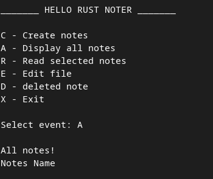
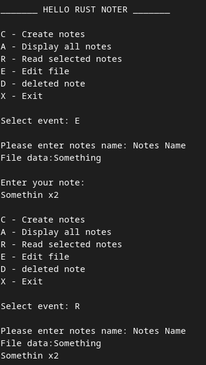
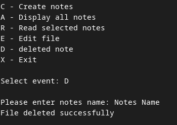

# Primitive note-taking program

## Program Functions

<ul>
	<li>Creating notes</li>
	<li>Display notes</li>
	<li>Reading notes</li>
	<li>Editing notes</li>
	<li>Deleting notes</li>
	<li>Exit</li>
</ul>

<br/>

## Creating notes


## Display notes



## Reading

### Reading empty note


### Reading not empty note


## Editing



## Deleting



<br>

# Run app

```cargo
	cargo run
```
